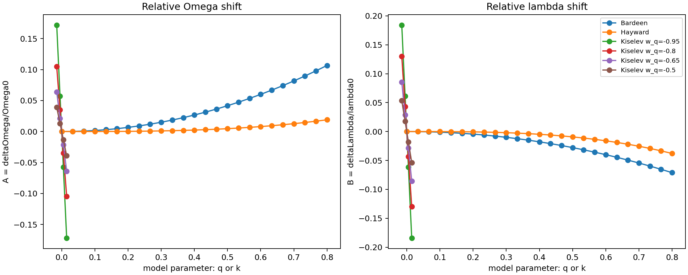

# Inverse QNM Matter Diagnostics

This repository implements inverse diagnostics for effective matter
distributions around black holes using one complex eikonal quasinormal-mode
frequency.

The goal is not to reconstruct the full matter profile from a single QNM.
Instead, the code extracts the matter combinations that are actually fixed by
the static anisotropic-fluid formulas:

- `delta_f(r0)`, the metric deformation at the photon sphere
- `I_rho`, an integrated density diagnostic outside the photon sphere
- `rho(r0)(1+w_theta)`, a local density-pressure combination

One complex QNM gives two real observables, `Omega` and `lambda`. Therefore the
full density profile `rho(r)` and `w_theta` cannot be determined separately
without adding an extra model assumption.

## Physics

The eikonal QNM relation is

```text
omega_QNM = ell * Omega - i * (n + 1/2) * lambda
```

Given `omega_QNM`, `ell`, `n`, and `M`, the script computes

```text
Omega  = Re(omega_QNM) / ell
lambda = -Im(omega_QNM) / (n + 1/2)
```

using Schwarzschild reference values

```text
Omega0 = 1/(3 sqrt(3) M)
lambda0 = 1/(3 sqrt(3) M)
r0 = 3M
```

The relative shifts are

```text
A = deltaOmega/Omega0  = Omega/Omega0 - 1
B = deltaLambda/lambda0 = lambda/lambda0 - 1
```

The inferred matter diagnostics are

```text
delta_f(r0) = (2/3) * A

I_rho = integral_{r0}^{infinity} rho(s) s^2 ds
      = r0 * A / (12*pi)

local_combo = rho(r0) * (1 + w_theta)
            = (A - B) / (4*pi*r0^2)
```

## Validation Models

The script validates the inverse formulas using three forward examples:

- Kiselev analytic QNM shifts with parameters `(w_q, k)`
- Bardeen first-order shifts:
  - `deltaOmega/Omega0 = q^2/(6 M^2)`
  - `deltaLambda/lambda0 = -q^2/(9 M^2)`
- Hayward first-order shifts:
  - `deltaOmega/Omega0 = q^3/(27 M^3)`
  - `deltaLambda/lambda0 = -2 q^3/(27 M^3)`

## Conditional Profile Reconstruction

The script also includes an optional reconstruction under the assumed density
profile

```text
rho(r) = rho0 * exp(-(r-r0)/L)
```

with fixed `L`. Under that assumption, it estimates `rho0` and `w_theta`.
This is conditional on the chosen profile and should not be interpreted as a
model-independent matter reconstruction.

## Quick Start

Install dependencies:

```powershell
pip install -r requirements.txt
```

Run:

```powershell
python inverse_qnm_matter_diagnostics.py
```

Outputs are written to:

```text
outputs/inverse_diagnostics/
```

## Outputs

- `inverse_diagnostics.csv`
- `profile_reconstruction.csv`
- `relative_shifts_by_model.png`
- `I_rho_by_model.png`
- `local_combo_by_model.png`
- `diagnostic_trend_comparison.png`

## Figures



Caption: Relative shifts `A = deltaOmega/Omega0` and
`B = deltaLambda/lambda0` versus the model parameter. Bardeen and Hayward use
`q`; Kiselev uses `k` at several fixed `w_q` values.


Caption: Inferred integrated density diagnostic `I_rho`.


Caption: Inferred local combination `rho(r0)(1+w_theta)`.


Caption: Comparison of diagnostic trend ranges across Kiselev, Bardeen, and
Hayward examples.

## Scientific Status

This is a compact inverse-analysis prototype. It is physically meaningful
because it computes the diagnostic combinations implied by static
anisotropic-fluid QNM-shift relations. It is also intentionally conservative:
it does not claim that one complex QNM uniquely determines `rho(r)` or
`w_theta`.
