# What Can One Eikonal QNM Tell Us About Effective Matter?

Inverse diagnostics for the effective matter combinations constrained by
eikonal QNM shifts around black holes.

This repository is a careful research prototype. It starts from one complex
eikonal QNM frequency and extracts the effective matter combinations fixed by
static anisotropic-fluid perturbative formulas.

## Main limitation

A single complex eikonal QNM provides only two real quantities: `Omega` and
`lambda`.

Therefore, this code does not reconstruct the full matter profile `rho(r)`,
and it does not determine `w_theta` separately in a profile-independent way
within the perturbative setup.
Instead, it extracts only the combinations of metric and matter variables that
are fixed by the perturbative formulas.

The diagnostic combinations fixed by the perturbative formulas are:

- `delta_f(r0)`: metric deformation at the photon sphere
- `I_rho`: integrated density diagnostic outside the photon sphere
- `rho(r0) * (1 + w_theta)`: local density-pressure combination

Any reconstruction of `rho0` or `w_theta` requires an additional assumed
density profile.

## Physics

The eikonal QNM relation is

```text
omega_QNM = ell * Omega - i * (n + 1/2) * lambda
```

Given `omega_QNM`, `ell`, `n`, and `M`, the script computes

```text
Omega = Re(omega_QNM) / ell
lambda = -Im(omega_QNM) / (n + 1/2)
```

using Schwarzschild reference values

```text
Omega0 = 1/(3 sqrt(3) M)
lambda0 = 1/(3 sqrt(3) M)
r0 = 3M
```

The relative shifts are

```text
A = deltaOmega/Omega0 = Omega/Omega0 - 1
B = deltaLambda/lambda0 = lambda/lambda0 - 1
```

The inferred diagnostic combinations are

```text
delta_f(r0) = (2/3) * A

I_rho = integral_{r0}^{infinity} rho(s) s^2 ds
      = r0 * A / (12*pi)

local_combo = rho(r0) * (1 + w_theta)
            = (A - B) / (4*pi*r0^2)
```

Here `I_rho` is an integrated diagnostic, not a full density reconstruction,
and `local_combo` is the combination `rho(r0) * (1 + w_theta)`.

## Forward examples and sanity checks

The script sanity-checks the inverse diagnostic pipeline using three forward
examples with known first-order eikonal QNM shifts:

- Kiselev analytic QNM shifts with parameters `(w_q, k)`
- Bardeen first-order shifts:
  - `deltaOmega/Omega0 = q^2/(6 M^2)`
  - `deltaLambda/lambda0 = -q^2/(9 M^2)`
- Hayward first-order shifts:
  - `deltaOmega/Omega0 = q^3/(27 M^3)`
  - `deltaLambda/lambda0 = -2 q^3/(27 M^3)`

These checks show that the inverse diagnostic pipeline recovers the effective
combinations implied by these known shift formulas.

## Optional toy-profile reconstruction

This step is not profile-independent. It only shows what `rho0` and `w_theta`
would be if the exponential density profile were assumed:

```text
rho(r) = rho0 * exp(-(r - r0) / L)
```

The results should not be interpreted as a unique reconstruction of the matter
distribution.

With fixed `L`, the code uses `I_rho` to estimate `rho0`, then uses
`local_combo = rho(r0) * (1 + w_theta)` to estimate a conditional value of
`w_theta`. This is a toy assumed profile, not a profile-independent result.

## Quick Start

Install dependencies:

```powershell
pip install -r requirements.txt
```

Run:

```powershell
python inverse_qnm_matter_diagnostics.py
```

Outputs are written to:

```text
outputs/inverse_diagnostics/
```

Run the rotating Kerr residual baseline demo:

```powershell
python rotating_kerr_residual_diagnostics.py
```

Rotating-baseline outputs are written to:

```text
outputs/rotating_kerr_residuals/
```

## Outputs

- `inverse_diagnostics.csv`
- `profile_reconstruction.csv`
- `relative_shifts_bardeen_hayward.png`
- `relative_shifts_kiselev.png`
- `I_rho_bardeen_hayward.png`
- `I_rho_kiselev.png`
- `local_combo_bardeen_hayward.png`
- `local_combo_kiselev.png`
- `diagnostic_trend_qualitative_comparison.png`

Rotating Kerr residual outputs:

- `kerr_residual_demo.csv`
- `schwarzschild_limit_check.csv`
- `toy_rotating_residuals.csv`
- `kerr_photon_radius_vs_spin.png`
- `kerr_photon_frequency_vs_spin.png`
- `kerr_lyapunov_vs_spin.png`
- `synthetic_kerr_residual_recovery.png`
- `rotating_residual_A_vs_q.png`
- `rotating_residual_B_vs_q.png`
- `rotating_residual_A_vs_spin.png`

## Figures


Caption: Relative shifts `A = deltaOmega/Omega0` and
`B = deltaLambda/lambda0` versus `q / M` for Bardeen and Hayward.


Caption: Relative shifts `A = deltaOmega/Omega0` and
`B = deltaLambda/lambda0` versus `k` for Kiselev at fixed `w_q` values.

For the Kiselev examples, `k` is treated as a small amplitude parameter in
units with `M = 1`. Its dimensional interpretation depends on `w_q`, so
comparisons across different `w_q` values should be read as qualitative trends.

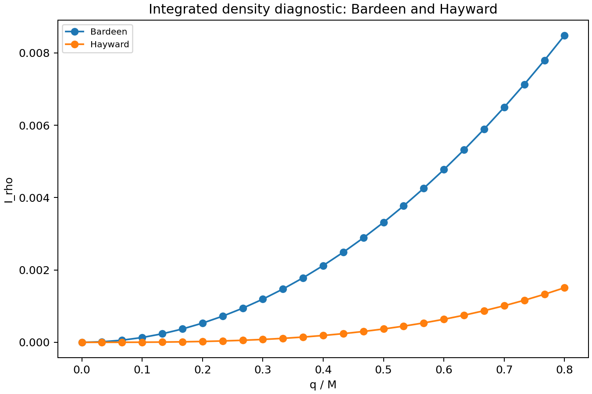

Caption: Inferred integrated density diagnostic `I_rho` versus `q / M` for
Bardeen and Hayward.

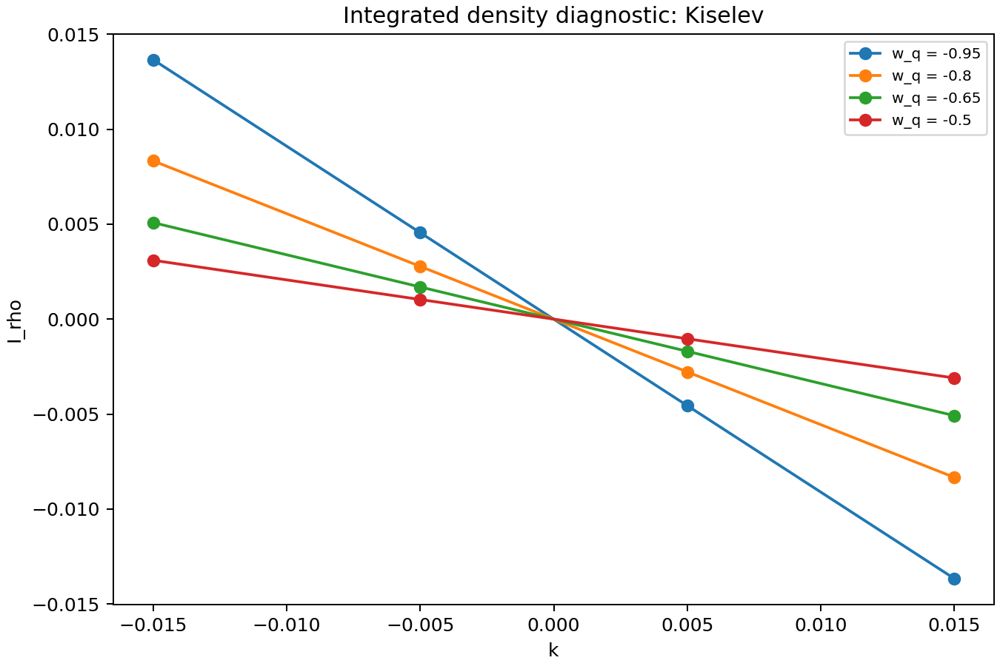

Caption: Inferred integrated density diagnostic `I_rho` versus `k` for Kiselev
at fixed `w_q` values.

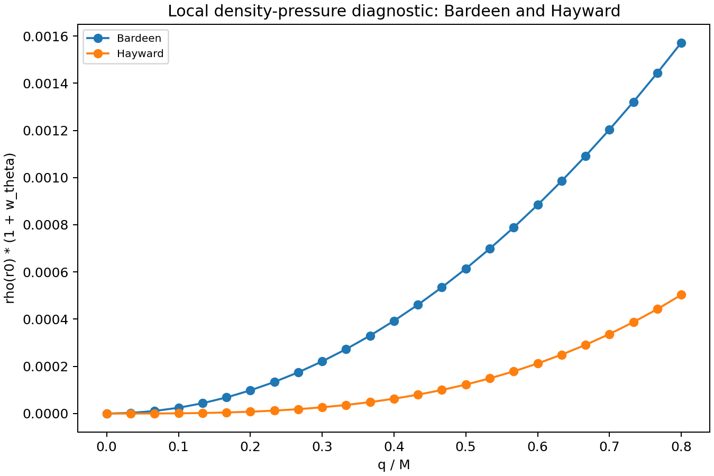

Caption: Inferred local combination `rho(r0) * (1 + w_theta)` versus `q / M`
for Bardeen and Hayward.

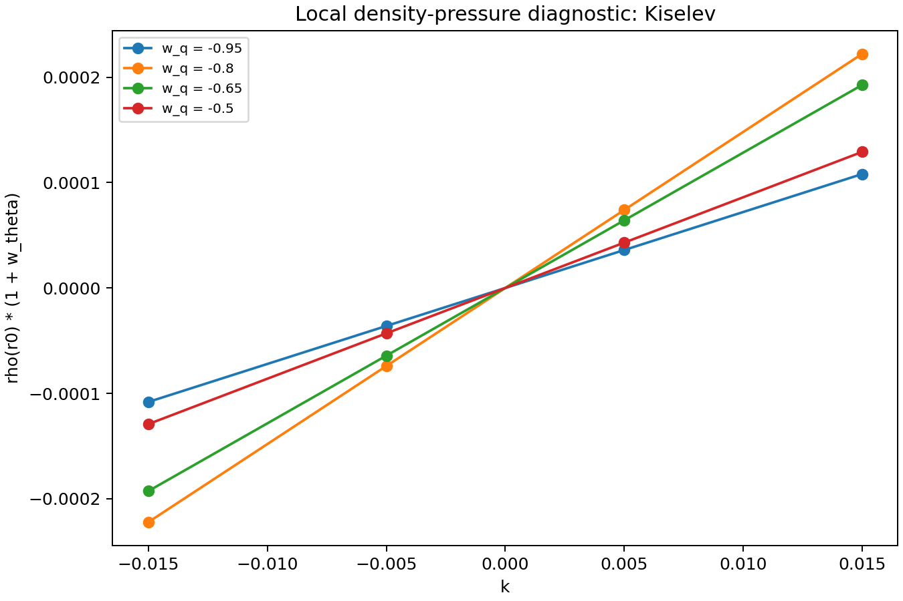

Caption: Inferred local combination `rho(r0) * (1 + w_theta)`. This is a
diagnostic combination, not a separate determination of `rho(r0)` and
`w_theta`. The plot shows Kiselev trends versus `k` at fixed `w_q` values.


This comparison is qualitative only. The sampled parameter intervals are
model-dependent, and the parameters `q` and `k` do not have the same physical
meaning. Therefore, the bars should not be interpreted as a direct physical
ranking of the models.

## Rotating Kerr baseline

Before applying the inverse diagnostic idea to real gravitational-wave data,
the rotating Kerr baseline must be removed. Real merger remnants are rotating
black holes, so comparing an observed ringdown directly with a Schwarzschild
reference would mix spin effects with any possible effective-matter or
hair-like residual.

This repository therefore includes a rotating Kerr residual diagnostic module.
It computes the equatorial Kerr photon-ring radius, signed orbital frequency,
and Lyapunov exponent, then compares an input eikonal QNM frequency with the
Kerr baseline.

For the equatorial Kerr baseline, the relevant phase number is the azimuthal
number `m`, not only `ell`:

```text
omega_QNM = m * Omega_phi - i * (n + 1/2) * lambda
```

Here `ell` can still be stored as mode metadata, but it is not used to extract
the rotating equatorial orbital frequency. The extraction uses:

```text
Omega_obs = Re(omega_QNM) / abs(m)
lambda_obs = -Im(omega_QNM) / (n + 0.5)
```

The geodesic frequency `Omega_phi`, reported in the code as
`Omega_Kerr_signed`, is signed by branch convention: prograde branches are
positive and retrograde branches are negative. Real QNM frequencies are usually
reported with positive real part, so the residual diagnostic compares positive
frequency magnitudes:

```text
Omega_Kerr_abs = abs(Omega_Kerr_signed)
A_Kerr = Omega_obs/Omega_Kerr_abs - 1
B_Kerr = lambda_obs/lambda_Kerr - 1
```

The demo uses `M = 1`, `a = 0.7`, `ell = 2`, `m = 2`, `n = 0`, and the
prograde branch. In this convention, prograde uses `branch = +1` with `m > 0`,
while retrograde uses `branch = -1` with `m < 0`.

The synthetic demo injects:

```text
A_Kerr = 0.01
B_Kerr = -0.02
```

It constructs the positive-real-frequency synthetic QNM with `abs(m)`, recovers
the residuals, and saves the injected-versus-recovered comparison plot. These
residuals should be interpreted as shifts relative to Kerr, not yet as direct
matter diagnostics.

The module also saves a Schwarzschild-limit sanity check. At `a = 0`, it
verifies:

```text
M * lambda_Kerr ~= 1/(3*sqrt(3)) ~= 0.19245
```

The rotating module is a baseline-removal step. A physical rotating
matter/hair interpretation requires additional perturbative formulas for the
chosen rotating metric model.

## Baseline sanity checks

The pure Kerr plots show the baseline that must be removed before interpreting
real data. They are not the matter/hair physics of the paper by themselves;
they only verify the Kerr photon-ring quantities used as the reference.

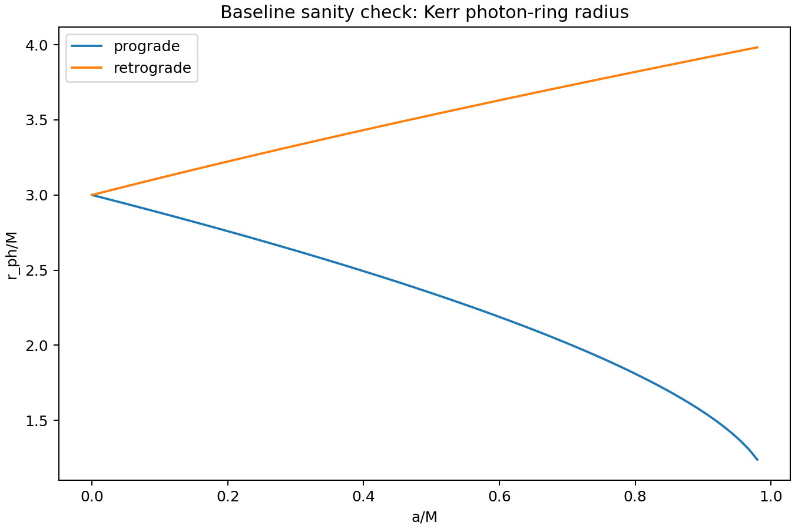

Caption: Baseline sanity check for the equatorial Kerr photon-ring radius
versus spin for prograde and retrograde branches.

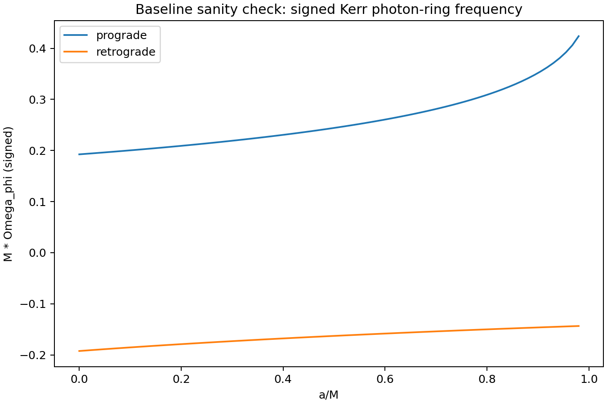

Caption: Baseline sanity check for the signed equatorial Kerr photon-ring
orbital frequency versus spin. The sign tracks the branch convention.

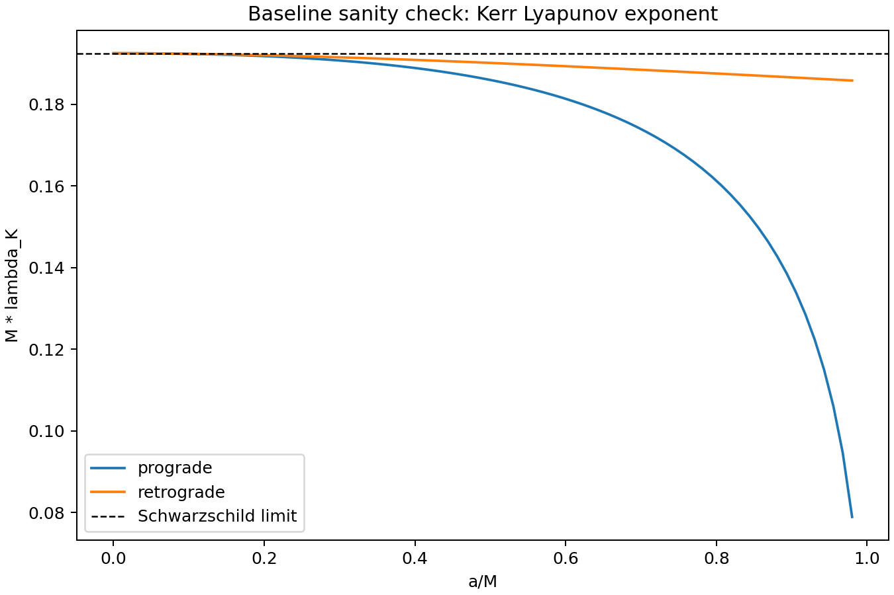

Caption: Baseline sanity check for the numerical coordinate-time Lyapunov
exponent versus spin. The dashed line marks the Schwarzschild limit
`M * lambda_Kerr = 1/(3 sqrt(3))`.

The Schwarzschild-limit check is also saved numerically in
`schwarzschild_limit_check.csv`.

## Rotating residual diagnostics inspired by the paper

The residual plots are closer to the paper's idea: they show how a
matter/hair-like perturbation would shift the eikonal QNM quantities relative
to Kerr.

The plotted residual quantities are:

```text
A_Kerr = Omega_perturbed/Omega_Kerr - 1
B_Kerr = lambda_perturbed/lambda_Kerr - 1
```

In the current rotating demo, these are synthetic toy residual shifts:

```text
A_Kerr = A_Kerr(q, a, branch)
B_Kerr = B_Kerr(q, a, branch)
```

The residual formulas in this demo are placeholders unless replaced by the
explicit perturbative expressions from the paper.

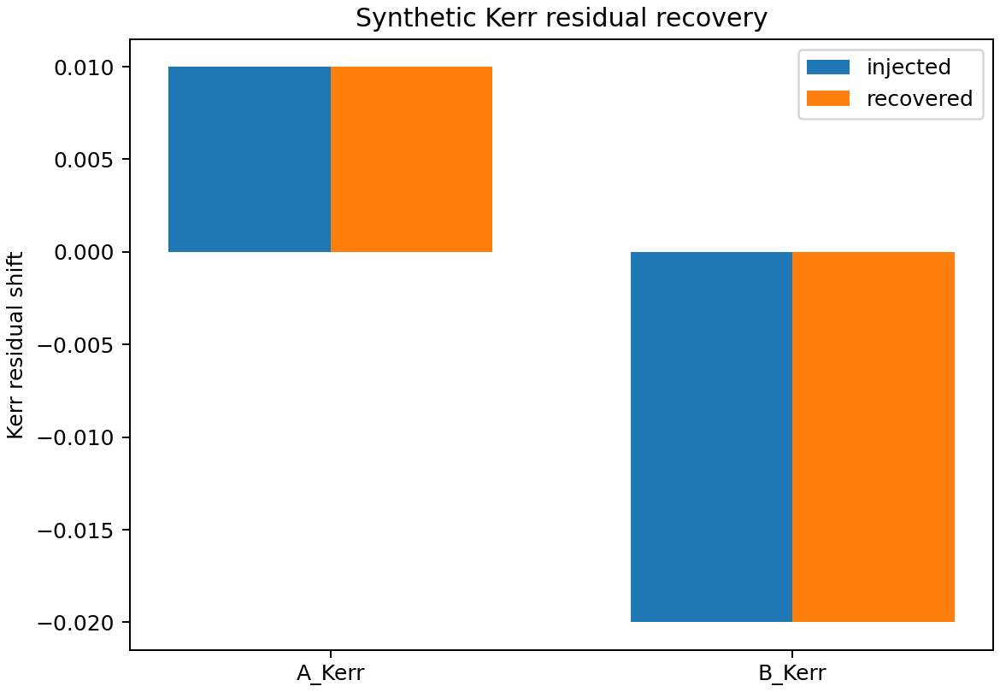

Caption: Injected versus recovered Kerr residual shifts for a synthetic QNM.
This tests the residual extraction before using observational data.

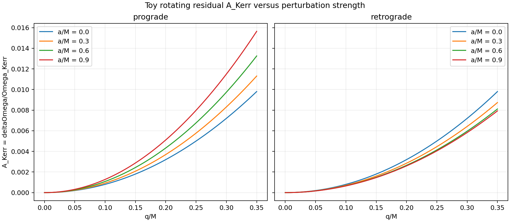

Caption: Toy residual shift `A_Kerr = deltaOmega/Omega_Kerr` versus `q/M`.
Curves show several spins, with prograde and retrograde branches separated.

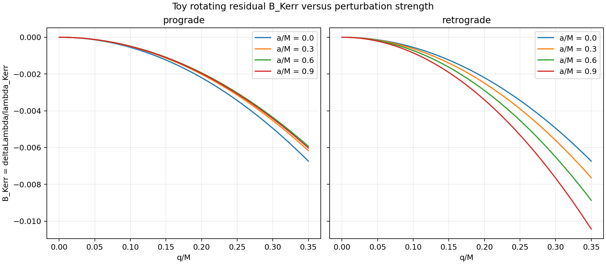

Caption: Toy residual shift `B_Kerr = deltaLambda/lambda_Kerr` versus `q/M`.
Curves show several spins, with prograde and retrograde branches separated.

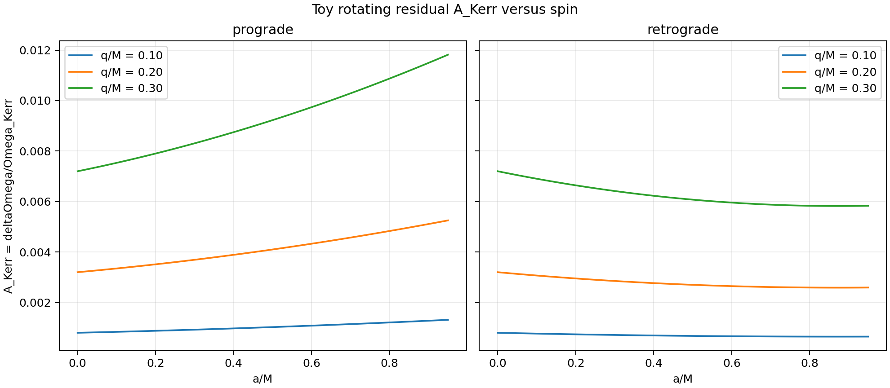

Caption: Toy residual shift `A_Kerr` versus spin for several fixed
perturbation strengths `q/M`.

## Scientific Status

This is a compact inverse-analysis prototype. It computes effective matter
combinations implied by static anisotropic-fluid QNM-shift relations. It is
intentionally conservative: it does not claim that one complex QNM determines
`rho(r)`, `w_theta`, or the full matter distribution.
