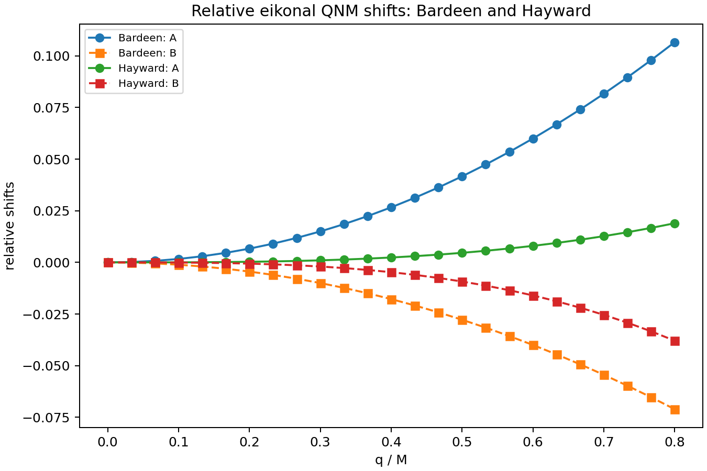
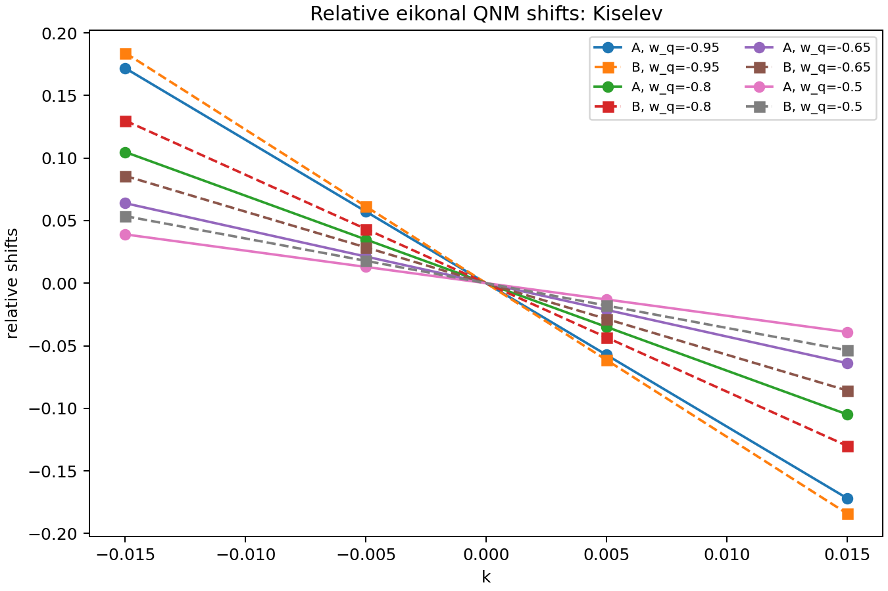
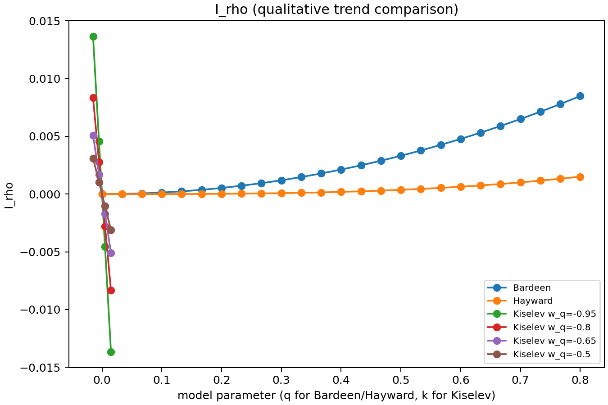
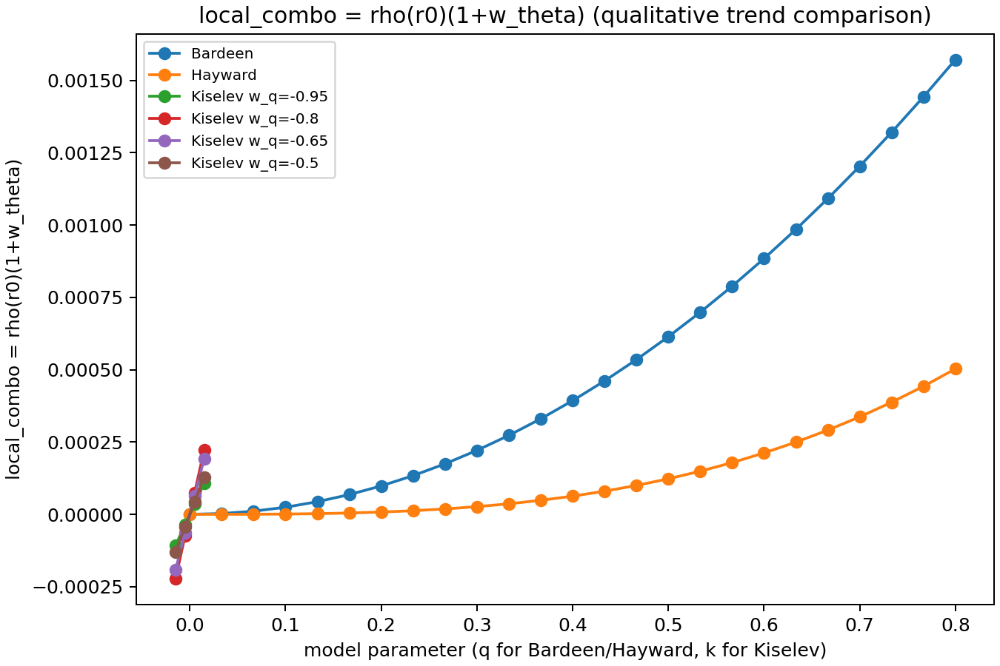
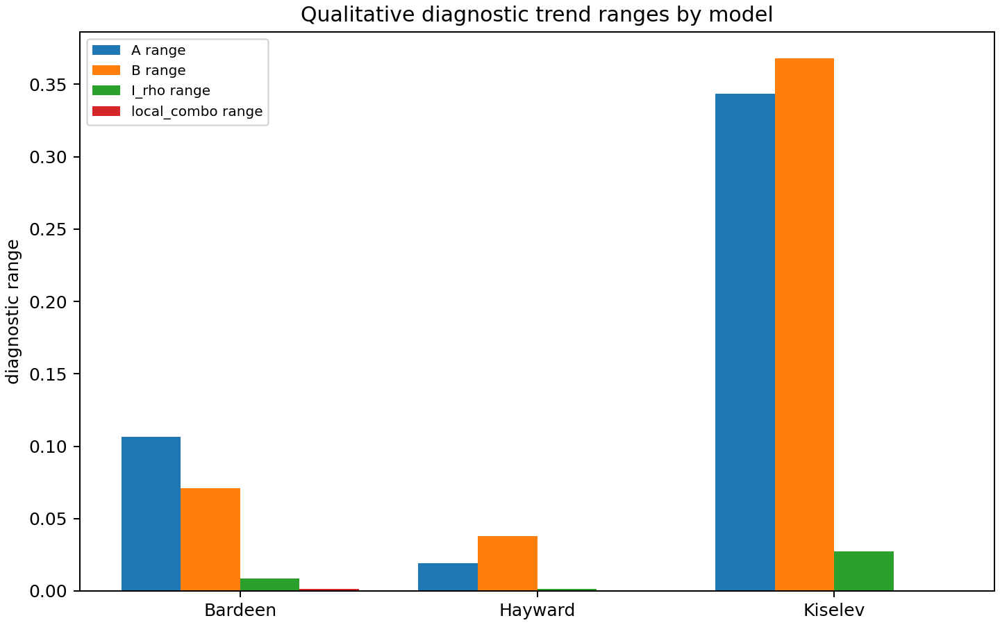

# What Can One Eikonal QNM Tell Us About Effective Matter?

Inverse diagnostics for the matter combinations fixed by eikonal QNM shifts
around black holes.

This repository is a careful research prototype. It starts from one complex
eikonal QNM frequency and extracts the effective matter combinations fixed by
static anisotropic-fluid perturbative formulas.

## Main limitation

A single complex eikonal QNM provides only two real quantities: `Omega` and
`lambda`.

Therefore, this code does not reconstruct the full matter profile `rho(r)`,
and it does not determine `w_theta` separately in a model-independent way.
Instead, it extracts only the combinations of metric and matter variables that
are fixed by the perturbative formulas.

The model-independent diagnostics are:

- `delta_f(r0)`: metric deformation at the photon sphere
- `I_rho`: integrated density diagnostic outside the photon sphere
- `rho(r0) * (1 + w_theta)`: local density-pressure combination

Any reconstruction of `rho0` or `w_theta` requires an additional assumed
density profile.

## Physics

The eikonal QNM relation is

```text
omega_QNM = ell * Omega - i * (n + 1/2) * lambda
```

Given `omega_QNM`, `ell`, `n`, and `M`, the script computes

```text
Omega = Re(omega_QNM) / ell
lambda = -Im(omega_QNM) / (n + 1/2)
```

using Schwarzschild reference values

```text
Omega0 = 1/(3 sqrt(3) M)
lambda0 = 1/(3 sqrt(3) M)
r0 = 3M
```

The relative shifts are

```text
A = deltaOmega/Omega0 = Omega/Omega0 - 1
B = deltaLambda/lambda0 = lambda/lambda0 - 1
```

The inferred diagnostic combinations are

```text
delta_f(r0) = (2/3) * A

I_rho = integral_{r0}^{infinity} rho(s) s^2 ds
      = r0 * A / (12*pi)

local_combo = rho(r0) * (1 + w_theta)
            = (A - B) / (4*pi*r0^2)
```

Here `I_rho` is an integrated diagnostic, not a full density reconstruction,
and `local_combo` is the combination `rho(r0) * (1 + w_theta)`.

## Validation Models

The script validates the inverse formulas using three forward examples:

- Kiselev analytic QNM shifts with parameters `(w_q, k)`
- Bardeen first-order shifts:
  - `deltaOmega/Omega0 = q^2/(6 M^2)`
  - `deltaLambda/lambda0 = -q^2/(9 M^2)`
- Hayward first-order shifts:
  - `deltaOmega/Omega0 = q^3/(27 M^3)`
  - `deltaLambda/lambda0 = -2 q^3/(27 M^3)`

The validation checks that the inverse diagnostic pipeline recovers the
effective combinations implied by these known shift formulas.

## Optional toy-profile reconstruction

This step is not model-independent. It only shows what `rho0` and `w_theta`
would be if the exponential density profile were assumed:

```text
rho(r) = rho0 * exp(-(r - r0) / L)
```

The results should not be interpreted as a unique reconstruction of the matter
distribution.

With fixed `L`, the code uses `I_rho` to estimate `rho0`, then uses
`local_combo = rho(r0) * (1 + w_theta)` to estimate a conditional value of
`w_theta`. This is a toy assumed profile, not a model-independent result.

## Quick Start

Install dependencies:

```powershell
pip install -r requirements.txt
```

Run:

```powershell
python inverse_qnm_matter_diagnostics.py
```

Outputs are written to:

```text
outputs/inverse_diagnostics/
```

## Outputs

- `inverse_diagnostics.csv`
- `profile_reconstruction.csv`
- `relative_shifts_bardeen_hayward.png`
- `relative_shifts_kiselev.png`
- `I_rho_by_model.png`
- `local_combo_by_model.png`
- `diagnostic_trend_qualitative_comparison.png`

## Figures



Caption: Relative shifts `A = deltaOmega/Omega0` and
`B = deltaLambda/lambda0` versus `q / M` for Bardeen and Hayward.



Caption: Relative shifts `A = deltaOmega/Omega0` and
`B = deltaLambda/lambda0` versus `k` for Kiselev at fixed `w_q` values.



Caption: Inferred integrated density diagnostic `I_rho`. This is a qualitative
trend plot because the sampled parameter intervals are model-dependent.



Caption: Inferred local combination `rho(r0) * (1 + w_theta)`. This is a
diagnostic combination, not a separate determination of `rho(r0)` and
`w_theta`.



Caption: Qualitative diagnostic-range comparison across validation models. The
range comparison is qualitative only. The sampled parameter intervals are
model-dependent, so the bars should not be interpreted as a direct physical
ranking of the models.

## Scientific Status

This is a compact inverse-analysis prototype. It computes effective matter
combinations implied by static anisotropic-fluid QNM-shift relations. It is
intentionally conservative: it does not claim that one complex QNM determines
`rho(r)`, `w_theta`, or the full matter distribution.
